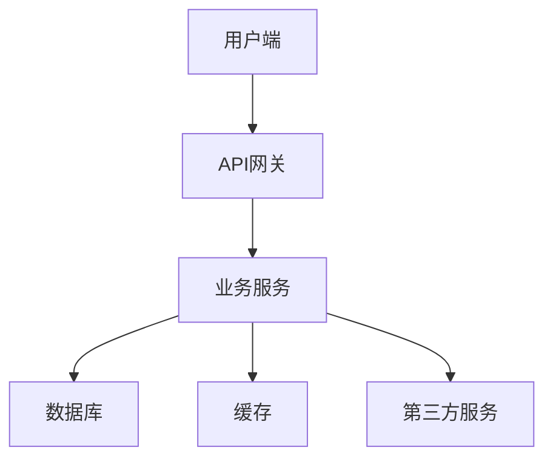

# 产品需求文档 (PRD) 模板

## 8章节标准结构

---

## 1. 项目背景

### 1.1 产品定位
[在此描述产品的市场定位和核心价值主张]

### 1.2 目标用户
[描述目标用户群体画像，包括：
- 用户年龄段
- 职业特征
- 使用场景
- 痛点需求]

### 1.3 产品愿景
[描述产品的长期愿景和使命]

---

## 2. 竞品分析

### 2.1 市场概况
[描述市场规模、增长趋势]

### 2.2 主要竞品
| 竞品名称 | 核心功能 | 优点 | 缺点 |
|---------|---------|------|------|
| 竞品A | 功能1, 功能2 | 优点1, 优点2 | 缺点1, 缺点2 |
| 竞品B | 功能1, 功能2 | 优点1, 优点2 | 缺点1, 缺点2 |

### 2.3 差异化策略
[描述本产品与竞品的差异化优势]

---

## 3. 产品架构

### 3.1 系统架构图

### 3.2 信息架构
[描述产品的信息组织结构]

### 3.3 功能模块
| 模块名称 | 描述 | 优先级 |
|---------|------|--------|
| 模块1 | 功能描述 | P0 |
| 模块2 | 功能描述 | P1 |

---

## 4. 功能需求

### 4.1 核心功能

#### 功能1：XXX
**描述**：详细描述功能

**用户流程**：

**输入**：
- 参数1：类型、必填、说明
- 参数2：类型、必填、说明

**输出**：
- 结果说明

**边界情况**：
- 情况1及处理方式
- 情况2及处理方式

### 4.2 用户流程
[描述主要用户业务流程]

### 4.3 接口需求
| 接口名称 | 方法 | 路径 | 功能 |
|---------|------|------|------|
| 接口1 | GET | /api/xxx | 获取xxx |

---

## 5. 非功能需求

### 5.1 性能需求
- 页面加载时间 < 3秒
- API响应时间 < 200ms (P95)
- 并发用户数 > 1000

### 5.2 安全需求
- 用户数据加密存储
- HTTPS传输加密
- 敏感操作日志记录

### 5.3 兼容性需求
- 支持 Chrome 90+
- 支持 Firefox 88+
- 支持 Safari 14+
- 移动端响应式适配

### 5.4 可用性需求
- 系统可用性 > 99.9%
- 故障恢复时间 < 30分钟

---

## 6. 数据需求

### 6.1 核心数据指标
| 指标名称 | 计算方式 | 埋点位置 |
|---------|---------|---------|
| DAU | 每日独立访客数 | 启动 |
| 留存率 | 次日/7日/30日留存 | 启动 |

### 6.2 数据埋点
| 事件名称 | 参数 | 说明 |
|---------|------|------|
| page_view | page_name, referrer | 页面浏览 |
| button_click | button_id, page_name | 按钮点击 |

### 6.3 数据存储
- 用户数据保留期限：90天
- 日志数据保留期限：30天

---

## 7. 版本规划

### 7.1 MVP (v1.0)
**发布时间**：[预计日期]

**功能范围**：
- [x] 核心功能1
- [x] 核心功能2

### 7.2 v1.1
**发布时间**：[预计日期]

**功能范围**：
- [ ] 功能3
- [ ] 功能4

### 7.3 v2.0
**发布时间**：[预计日期]

**功能范围**：
- [ ] 功能5
- [ ] 功能6

---

## 8. 附录

### 8.1 术语表
| 术语 | 定义 |
|------|------|
| 术语1 | 定义说明 |

### 8.2 参考资料
- 参考文档1：链接
- 参考文档2：链接

### 8.3 修改历史
| 版本 | 日期 | 修改人 | 修改内容 |
|------|------|--------|---------|
| v1.0 | 2024-01-01 | 张三 | 初始版本 |

---

**文档状态**：草稿 / 已确认 / 已归档
