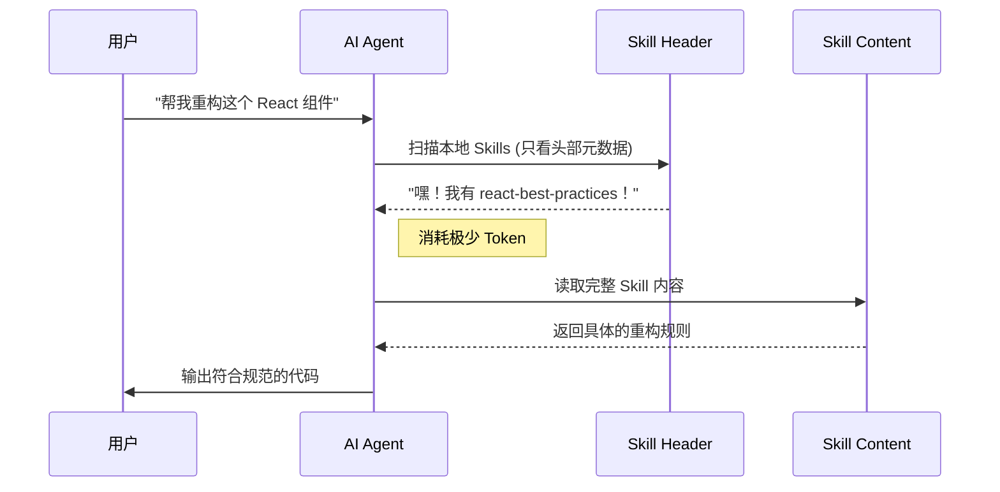

# Skills.sh：给你的 AI 代理装上“外挂”库，真香！

## 1. 技术背景介绍 (The "Why" & "What")
> *还记得以前给 AI 写 Prompt 写到手抽筋的日子吗？或者看着 AI 一本正经地胡说八道，把你的代码改得面目全非？*

在这个 AI 满天飞的时代，我们都在追求更聪明、更懂我们代码规范的 AI 代理（Agent）。但是，**Context Window（上下文窗口）** 就像是北京的房价——永远不够用！你想把所有的最佳实践、代码规范都塞给 AI，结果它直接“爆内存”或者开始因为上下文太长而变笨。

MCP (Model Context Protocol) 虽然强大，但有时候感觉就像是为了杀一只鸡（格式化代码）而请来了一支特种部队（启动一个全功能的服务器）。太重了！

这时候，**Vercel** 大佬带着 **skills.sh** 闪亮登场了。简单来说，它就是 **AI 代理界的 npm**。它收录了 **27,000+** 个 Skills（是的，你没听错，两万七千多！），旨在让你的 AI 代理瞬间学会各种“绝世武功”，而且还不会撑爆它的脑子。

它解决了什么核心痛点？
- **上下文减肥**：不需要一次性把所有规则都喂给 AI，用的时候再拿。
- **标准化**：不再需要每个人都手写一份“如何写 React 组件”的 Prompt。
- **开箱即用**：一条命令，AI 变身专家。

## 2. 核心原理剖析 (Under the Hood)
> *这玩意儿到底是怎么做到“多快好省”的？*

skills.sh 的核心魔法在于 **Markdown** 和 **渐进式加载 (Progressive Loading)**。

### 2.1 架构总览
这就好比你不需要把整个图书馆的书都背下来，只需要一本索引目录。

```mermaid
graph TD
    User[用户/开发者] -->|npx skills add| CLI[Skills CLI]
    CLI -->|下载| Registry[skills.sh Registry]
    Registry -->|返回 Markdown| Local[本地 .cursor/skills 目录]
    Local -->|按需读取| Agent[AI Agent (Claude/Cursor)]
    
    subgraph "Magic Happens Here"
        Agent -- "只读 Header (50 tokens)" --> Local
        Agent -- "需要详情时展开" --> Content[Skill 完整内容]
    end
    
    style Registry fill:#f9f,stroke:#333,stroke-width:4px
    style Agent fill:#bbf,stroke:#333,stroke-width:2px
```
> *图注：这就是它的五脏六腑。所有的 Skill 其实就是精心编写的 Markdown 文件，存放在云端，按需下载到本地。*

### 2.2 关键流程
当你问 AI 一个问题时，它不会把所有 Skill 的内容都读进去，而是先看“目录”。


> *图注：一个请求的奇幻漂流。关键在于“扫描头部”这一步，它极大地节省了 Token，让你能安装几百个 Skill 而不卡顿。*

### 2.3 核心机制
- **Markdown 即代码**：Skill 本质上就是结构化的 Markdown 文件。AI 最懂 Markdown 了。
- **渐进式加载**：每个 Skill 的 Header 大约只占 50 tokens。这意味着你可以安装成百上千个 Skill，AI 依然身轻如燕。
- **匿名遥测排名**：大家都在用什么？数据说话。

## 3. 发展趋势分析 (Crystal Ball)
> *这玩意儿能火吗？我看行。*

- **当前热度**：发布首日，仅仅 `vercel-react-best-practices` 一个 Skill 就有超过 **20,000** 次安装。社区像炸了锅一样兴奋。
- **未来方向**：
    - **生态爆发**：就像 npm 一样，未来每个框架、每个库都会发布自己的官方 Skill。
    - **MCP 的轻量级替代**：对于静态规则和最佳实践，skills.sh 可能会完全取代复杂的 MCP 服务器。
    - **IDE 集成**：Cursor、VS Code 可能原生内置对 skills.sh 的支持（现在已经部分支持了）。

## 4. 重大里程碑 (Hall of Fame)
> *记录一下这个“新物种”的诞生。*

- **2026年1月**：Vercel 正式发布 **skills.sh**。
- **发布 6 小时内**：Top Skill 安装量突破 20,000+。
- **当前**：平台收录 Skills 数量突破 **27,000+**，覆盖了从 React、Next.js 到 Stripe、Python 等各个领域。

## 5. 示例代码演示 (Show Me the Code)
> *Talk is cheap, 怎么用？*

想让你的 AI 瞬间精通 React 最佳实践？不需要写几千字的 Prompt，只需要一行命令：

```bash
# 打开你的终端，在项目根目录下运行
# 这就像给 AI 打了一针“React 强化剂”
npx skills add vercel/react-best-practices

# 或者你想看看现在最火的 Skill 是什么？
# 访问 https://skills.sh 查看排行榜
```

安装后，你会在项目的 `.cursor/skills` (或者类似目录) 看到生成的 Markdown 文件。下次你让 AI 写代码时，它就会自动参考这些规则。

```markdown
<!-- 生成的 Skill 文件示例 (伪代码) -->
---
name: react-best-practices
description: Use when writing React components to ensure performance and maintainability.
---

# React Best Practices

1. Use functional components.
2. Avoid useEffect for derived state.
...
```

## 6. 总结与展望 (Final Thoughts)
> *别犹豫了，快上车！*

**skills.sh** 正在重新定义我们配置 AI 代理的方式。它把“调教 AI”这件事变得标准化、模块化、且极其轻量。

**核心价值**：
1.  **省 Token**：钱包的救星。
2.  **提效率**：一键同步团队代码规范。
3.  **高质量**：直接使用官方维护的最佳实践。

**学习建议**：
先别急着写代码，去 **[skills.sh](https://skills.sh)** 逛逛。看看排行榜上那些安装量最高的 Skill，把它们装进你的项目里。体验一下“开了挂”的 AI 是什么感觉！

---
*Generated by Technical Blog Writing Skill*
