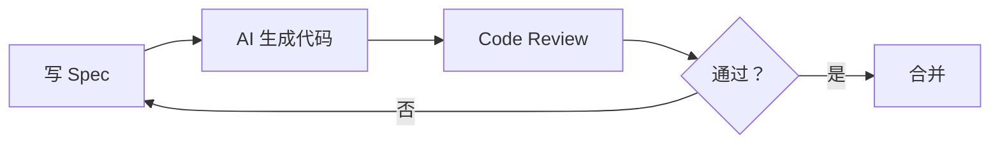

# OpenSpec VibeCoding 互动课程设计文档

**创建日期:** 2026-03-04
**更新日期:** 2026-03-06
**作者:** VibeCoding 推广团队
**版本:** 2.0

---

## 项目概述

### 目标
通过故事驱动的互动方式，让公司同事快速掌握 OpenSpec 编程，理解 VibeCoding 和 SpecCoding 的最佳实践。

### 课程定位
- **主题:** OpenSpec 入门和深入使用，以及与 spec-kit 的区别对比
- **形式:** 网页 + 视频的混合式互动课程
- **风格:** 生动、幽默、富有互动性
- **入口:** 在工具箱首页增加醒目的课程入口

### 核心理念
本课程不仅要教会用户如何使用 OpenSpec，更要传达一种**渐进式 AI 协作**的思维方式：

1. **初级阶段：** 详细指令，明确沟通 - 告诉 AI 每个细节
2. **中级阶段：** 使用 Rules，规范行为 - 建立协作默契
3. **高级阶段：** Spec 驱动，自主判断 - AI 自主理解上下文

### 学习路径设计

```
┌─────────────────────────────────────────────────────────────────┐
│                    OpenSpec 学习路径                             │
├─────────────────────────────────────────────────────────────────┤
│                                                                 │
│  第一阶段          第二阶段          第三阶段          第四阶段   │
│  ──────          ──────          ──────          ──────       │
│                                                                 │
│  🤔             📋             🚀             ⚡              │
│  谨慎使用        发现规则        进阶工具        自主判断        │
│  AI 小白          Rules 拯救       OpenSpec       高手阶段        │
│                                                                 │
│  • 详细指令       • 建立规范       • Spec 驱动      • 上下文理解   │
│  • 复制代码       • 约束行为       • 技能包         • 自主判断     │
│  • 反复确认       • 质量提升       • 效率提升       • 最小沟通     │
│                                                                 │
│  ↓                ↓                ↓                ↓           │
│                                                                 │
│  沟通成本：高      沟通成本：中      沟通成本：低      沟通成本：极低  │
│  AI 准确率：60%    AI 准确率：80%    AI 准确率：90%    AI 准确率：95%+ │
│                                                                 │
└─────────────────────────────────────────────────────────────────┘
```

---

## 故事驱动的课程结构

### 第一章："最初的我" - 谨慎使用 AI 😰

**核心目标:** 让学员理解初级阶段与 AI 沟通的必要细节，建立"详细沟通"的意识。

**内容:**

#### 1.1 故事引入
- 刚开始使用 AI 编程时的谨慎心态
- 什么都要描述得很清楚
- 要改的代码都会复制引用到对话中
- 心理活动：生怕 AI 理解错了

#### 1.2 详细沟通的必要性

**为什么需要详细沟通？**

在初级阶段，AI 没有上下文理解能力，需要用户提供完整的信息：

```
❌ 糟糕的指令：
"帮我改一下登录页面"

✅ 好的指令：
"我需要修改前端登录页面，具体如下：
1. 前端组件：frontend/src/components/Auth/LoginPage.tsx
2. 修改内容：在表单底部添加'记住我'复选框
3. 样式要求：使用 Tailwind CSS，复选框右侧对齐，文字为灰色
4. 后端接口：POST /api/v1/auth/login
5. 入参示例：{"email": "user@example.com", "password": "123456", "remember": true}
6. 出参示例：{"token": "eyJhbGc...", "expiresIn": 86400}
7. 需要同时修改类型定义：frontend/src/types/auth.ts"
```

#### 1.3 前端修改沟通模板

**修改前端组件时，需要说明的信息：**

| 信息类别 | 说明内容 | 示例 |
|----------|----------|------|
| **目标组件** | 要修改的文件路径 | `frontend/src/components/Header/Header.tsx` |
| **容器/区域** | 具体修改的位置 | "Header 组件右侧，用户头像按钮旁边" |
| **样式变更** | CSS/Tailwind 类名 | "添加 `ml-4 px-4 py-2 bg-blue-500 hover:bg-blue-600 text-white rounded`" |
| **功能逻辑** | 交互行为 | "点击后跳转到 /settings 页面，使用 useNavigate hook" |
| **调用接口** | 后端 API | "调用 GET /api/v1/user/profile 获取用户信息" |
| **入参示例** | 请求参数 | `{"userId": 123, "includeDetails": true}` |
| **出参示例** | 响应数据 | `{"id": 123, "name": "张三", "email": "..."}` |
| **类型定义** | TypeScript 类型 | "需要更新 `frontend/src/types/user.ts` 中的 User 接口" |

#### 1.4 后端接口沟通模板

**修改后端接口时，需要说明的信息：**

| 信息类别 | 说明内容 | 示例 |
|----------|----------|------|
| **目标路由** | API 路径和方法 | `POST /api/v1/auth/login` |
| **路由文件** | 代码位置 | `backend/app/routes/auth.py` |
| **入参模型** | Pydantic Schema | `class LoginRequest(BaseModel): email: str, password: str` |
| **出参模型** | 返回数据结构 | `class LoginResponse(BaseModel): token: str, user: UserDTO` |
| **业务逻辑** | 处理流程 | "1.验证邮箱格式 2.查询用户 3.验证密码 4.生成 JWT" |
| **错误处理** | 异常情况 | "401: 密码错误，404: 用户不存在，500: 服务器错误" |

#### 1.5 完整示例：修改 CrossShare 消息面板

**场景：** 在 CrossShare 消息面板中添加 Markdown 渲染功能

```markdown
## 需求描述
给 CrossShare 消息面板添加 Markdown 渲染功能

## 前端修改
### 目标组件
- 文件：frontend/src/components/Tools/CrossShare/MessagePanel.tsx
- 位置：消息内容展示区域（原第 45-52 行的 div）

### 样式变更
- 原样式：`<div className="message-content text-white/80">`
- 新样式：保持不变，但内部使用 ReactMarkdown 组件

### 功能逻辑
1. 引入 ReactMarkdown 组件
2. 将消息内容传入 Markdown 渲染
3. 支持代码高亮（使用 Prism.js）

### 调用接口
- GET /api/cross-share/messages/{id}
- 出参示例：
{
  "id": 1,
  "content": "# Hello\n\n这是一段 **Markdown** 内容",
  "created_at": "2026-03-06T10:00:00Z"
}

## 后端修改
### 目标路由
- 文件：backend/app/routes/cross_share.py
- 接口：GET /api/cross-share/messages/{id}

### 出参模型
- 文件：backend/app/schemas/cross_share.py
- 新增字段：content_rendered (可选，用于预渲染的 HTML)

## 类型定义
- 文件：frontend/src/types/cross-share.ts
- 更新：Message 接口添加 content_rendered?: string
```

#### 1.6 交互元素

**互动练习 1：** 识别好的指令
- 展示 3 个指令示例
- 让学员选择哪个指令更清晰
- 即时反馈和解析

**互动练习 2：** 填写沟通模板
- 给出一个修改场景
- 让学员填写完整的前端/后端修改信息
- 系统自动检查是否遗漏关键信息

**对比演示：**
- 左边：模糊指令导致的错误修改
- 右边：详细指令带来的准确修改

### 第二章："遇到问题" - AI 乱改代码的困扰 🤯
**内容:**
- AI 经常乱改代码，超出修改范围
- 改的东西不符合要求
- 觉得 AI 很傻很笨
- 逐渐失去信心

**交互元素:**
- 对比演示：期望的修改 vs AI 实际修改
- 互动测验：识别"AI 乱改"的常见场景

### 第三章："发现规则" - rules 的拯救 🎉
**内容:**
- 发现可以使用 rules 规范开发
- 一开始觉得惊艳很好用
- 代码质量明显提升
- 建立信心

**交互元素:**
- 代码示例：展示有效的 rules 配置
- 对比演示：有 rules 前后的 AI 输出对比

### 第四章："进阶工具" - OpenSpec & Superpowers 🚀

**核心目标：** 掌握 OpenSpec 的技能系统，理解每个技能的用途和使用场景。

#### 4.1 OpenSpec 是什么？

OpenSpec 是一个基于 Spec 的开发方法论，核心思想是：

1. **Spec First**：先写规范，再生成代码
2. **AI Native**：专为 AI 协作设计
3. **Iterative**：支持迭代和版本管理
4. **Skill-Based**：通过技能系统实现复杂任务

#### 4.2 OpenSpec 技能详解

OpenSpec 提供了一套完整的技能系统，每个技能都有明确的职责和使用场景：

---

##### 技能 1：openspec-new-change
**用途：** 创建一个新的变更（change），启动结构化的开发流程。

**什么时候使用：**
- ✅ 有一个新功能要开发
- ✅ 需要修复一个复杂的 bug
- ✅ 要进行代码重构
- ✅ 不确定具体实现方案，需要探索

**不适合的场景：**
- ❌ 简单的单文件修改（直接用 AI 对话即可）
- ❌ 紧急的热修复（来不及走完整流程）

**使用示例：**
```bash
# 创建一个名为 add-user-auth 的变更
openspec new change "add-user-auth"

# 创建一个自定义 schema 的变更
openspec new change "add-dashboard" --schema spec-driven
```

**工作流程：**
```
1. 用户描述需求 → 2. 创建 change 目录 → 3. 生成初始结构
                                        ↓
                              openspec/changes/add-user-auth/
                              ├── proposal.md
                              ├── design.md
                              ├── tasks.md
                              └── specs/
```

**输出产物：**
- `proposal.md` - 变更提案（Why、What、Impact）
- 后续可创建：`design.md`、`tasks.md`、`specs/`

---

##### 技能 2：openspec-explore（探索模式）
**用途：** 进入探索模式，作为思考伙伴帮助探索想法、调查问题、澄清需求。

**核心原则：**
- 🔍 **探索问题空间** - 提问、挑战假设、重构问题
- 📊 **可视化思考** - 使用 ASCII 图表、对比表格
- 🧠 **调查代码库** - 映射现有架构、识别集成点
- ⚖️ **比较选项** - 头脑风暴多个方案、分析权衡

**什么时候使用：**
- ✅ 需求不明确，需要澄清
- ✅ 面临多个技术方案，需要比较
- ✅  stuck 在某个问题上，需要灵感
- ✅ 要修改复杂系统，先理解影响范围

**重要提醒：**
> 🚫 探索模式不写代码！只用于思考和捕获想法。
> 准备好实现时，使用 `/opsx:new` 或 `/opsx:ff` 启动变更。

**使用示例：**
```
用户：我想给系统添加实时协作功能

助手：实时协作是个大方向，让我帮你思考一下...

     协作功能光谱
     ════════════════════════════════════

     感知层          协调层           同步层
        │               │               │
        ▼               ▼               ▼
     ┌────┐        ┌────┐         ┌────┐
     │在线 │        │多光标│        │CRDT │
     │人数 │        │选择 │        │冲突 │
     │状态 │        │操作 │        │解决 │
     └────┘        └────┘         └────┘
        │               │               │
     简单 (~1h)      中等 (~1d)      复杂 (~1w)

     你的需求更接近哪一层？
```

---

##### 技能 3：openspec-continue-change
**用途：** 继续一个进行中的变更，创建下一个所需的 artifact（产物）。

**什么时候使用：**
- ✅ 已经创建了 change，要继续创建下一个产物
- ✅  proposal 写好了，现在要创建设计文档
- ✅ 设计完成了，接下来要创建任务列表

**工作流程：**
```
1. 检查变更状态 → 2. 识别下一个可创建的 artifact → 3. 创建该 artifact
                                                          ↓
                                            如果是 proposal → 问用户需求
                                            如果是 design → 读 proposal 后写设计
                                            如果是 tasks → 读 design 后拆解任务
```

**使用示例：**
```bash
# 继续最近的变更
openspec continue change

# 继续指定的变更
openspec continue change "add-user-auth"
```

**产物创建顺序（spec-driven schema）：**
```
proposal.md (必须先创建)
    ↓
specs/<capability>/spec.md (每个 capability 一个)
    ↓
design.md
    ↓
tasks.md
```

---

##### 技能 4：openspec-ff-change（Fast-Forward）
**用途：** 快速跳过所有 artifact 的创建过程，一次性生成实现所需的所有产物。

**什么时候使用：**
- ✅ 需求明确，不需要逐步讨论
- ✅ 时间紧张，想跳过中间的确认步骤
- ✅ 已经有清晰的设计思路
- ✅ 小功能，不需要复杂的 artifact

**与 continue-change 的区别：**
| 对比项 | continue-change | ff-change |
|--------|-----------------|-----------|
| 创建速度 | 逐步确认 | 一次性生成 |
| 用户参与 | 每个 artifact 都可能需要确认 | 只需初始需求描述 |
| 适用场景 | 复杂功能、需要讨论 | 需求明确、快速实现 |
| 产物质量 | 经过多轮打磨 | 基于初始理解 |

**使用示例：**
```bash
# 快速创建所有产物
openspec ff change "add-login-button"

# 输出：
✓ Created proposal.md
✓ Created specs/user-auth/spec.md
✓ Created design.md
✓ Created tasks.md

所有产物已创建！使用 /opsx:apply 开始实现。
```

---

##### 技能 5：openspec-apply-change
**用途：** 实现变更中的任务，按照 tasks.md 逐一完成开发工作。

**什么时候使用：**
- ✅ 所有 artifact 已创建完成
- ✅ 开始写代码实现功能
- ✅ 继续之前未完成的实现

**工作流程：**
```
1. 读取 tasks.md → 2. 识别未完成的任务 → 3. 逐一实现
                                              ↓
                                    每个任务完成后标记 [x]
                                              ↓
                                    遇到 blocker → 暂停等待指示
```

**使用示例：**
```bash
# 开始实现变更
openspec apply change "add-user-auth"

# 输出：
## 实现中：add-user-auth

任务 1/7：创建用户模型
✓ 完成：backend/app/models/user.py

任务 2/7：创建认证路由
✓ 完成：backend/app/routes/auth.py

任务 3/7：创建前端登录表单
...
```

**状态处理：**
- `blocked` - 产物不完整，建议先用 continue-change 创建
- `all_done` - 所有任务完成，建议归档
- `in_progress` - 继续实现

---

##### 技能 6：openspec-sync-specs
**用途：** 将变更目录中的 delta specs 同步到主 specs 目录。

**什么时候使用：**
- ✅ 在变更中修改了 spec 文件
- ✅ 需要将修改合并到主规范
- ✅ 准备归档变更前

**同步逻辑：**
```
变更目录 specs/          主 specs/
openspec/changes/...    openspec/specs/
       ↓                      ↑
       └───── 同步 ───────────┘
```

**使用示例：**
```bash
openspec sync specs "add-user-auth"
```

---

##### 技能 7：openspec-archive-change
**用途：** 归档已完成的变更。

**什么时候使用：**
- ✅ 所有任务已完成
- ✅ 所有产物已创建
- ✅ spec 已同步到主目录

**归档流程：**
```
1. 检查 artifact 完成状态 → 2. 检查任务完成状态 → 3. 移动到 archive
                                                              ↓
                                        openspec/changes/archive/
                                        YYYY-MM-DD-add-user-auth/
```

**使用示例：**
```bash
# 归档变更
openspec archive change "add-user-auth"

# 输出：
## 归档完成
变更：add-user-auth
归档位置：openspec/changes/archive/2026-03-06-add-user-auth/
状态：所有产物完成 ✓ 所有任务完成 ✓
```

---

##### 技能 8：openspec-bulk-archive-change
**用途：** 批量归档多个已完成的变更。

**什么时候使用：**
- ✅ 有多个平行变更需要归档
- ✅ 一次迭代完成多个功能

---

##### 技能 9：openspec-verify-change
**用途：** 验证实现是否与变更产物一致。

**什么时候使用：**
- ✅ 实现完成后，检查是否遗漏
- ✅ 归档前确认所有任务完成
- ✅ 代码审查时

---

#### 4.3 技能选择决策树

```
开始
 │
 ▼
需求是否明确？
 │
 ├── 否 ──→ 使用 openspec-explore (探索模式)
 │          │
 │          ▼
 │       明确需求后
 │
 ▼
是明确的小功能？
 │
 ├── 是 ──→ 使用 openspec-ff-change (快速创建所有产物)
 │          │
 │          ▼
 │       直接使用 openspec-apply-change 实现
 │
 ▼
是复杂功能，需要讨论？
 │
 ├── 是 ──→ 使用 openspec-new-change + openspec-continue-change
 │          │
 │          ▼
 │       逐步创建 proposal → specs → design → tasks
 │
 ▼
实现中遇到问题？
 │
 ├── 是 ──→ 回到 openspec-explore (探索模式) 重新思考
 │
 ▼
实现完成 → openspec-verify-change (验证) → openspec-archive-change (归档)
```

#### 4.4 Spec 文件示例

```yaml
# user-login.spec
feature: 用户登录
description: 用户可以通过邮箱和密码登录系统

requirements:
  - 用户输入邮箱和密码
  - 验证邮箱格式
  - 验证密码正确性
  - 登录成功返回 token
  - 失败显示错误信息

constraints:
  - 密码至少 8 位
  - token 有效期 24 小时
  - 支持记住登录状态

api:
  - POST /api/v1/auth/login
    request:
      email: string (required)
      password: string (required, min: 8)
      remember: boolean (optional)
    response:
      token: string
      expiresIn: number
      user: UserDTO
```

#### 4.5 Superpowers 技能包

Superpowers 是一套增强 AI 能力的技能系统：

- 🔍 **代码理解**：快速理解大型代码库
- 📝 **文档生成**：自动生成技术文档
- 🧪 **测试生成**：自动编写单元测试
- 🐛 **Bug 修复**：智能定位和修复问题

#### 4.6 我的工作流



#### 4.7 效率对比

| 开发阶段 | 传统方式 | AI + OpenSpec |
|----------|----------|---------------|
| 需求分析 | 2 小时 | 30 分钟 |
| 代码实现 | 8 小时 | 2 小时 |
| 代码 Review | 2 小时 | 30 分钟 |
| 单元测试 | 4 小时 | 1 小时 |
| **总计** | **16 小时** | **4 小时** |

效率提升 **4 倍**！🚀

### 第五章："对比思考" - 工具对比与最佳实践 ⚖️

**核心目标：** 理解 OpenSpec、spec-kit、superpowers (brainstorming) 的定位差异，掌握选择策略。

#### 5.1 三大工具全方位对比

##### 对比维度说明

我们从 9 个维度对三个工具进行对比：
1. **定位** - 工具的核心价值主张
2. **目标用户** - 最适合的使用人群
3. **学习曲线** - 上手的难易程度
4. **适用场景** - 最擅长解决的问题
5. **工作流** - 典型的使用流程
6. **产物输出** - 生成什么内容
7. **AI 协作深度** - 与 AI 的集成程度
8. **灵活性** - 适应不同工作流的能力
9. **社区生态** - 社区支持和资源丰富度

---

##### 完整对比表

| 对比维度 | OpenSpec | spec-kit | Superpowers (brainstorming) |
|----------|----------|----------|----------------------------|
| **定位** | Spec 驱动的结构化开发方法论 | GitHub 官方的 Spec 工具包 | 头脑风暴与设计探索技能 |
| **目标用户** | 追求高效 AI 协作的团队 | GitHub 重度用户、企业团队 | 需要设计先行的项目 |
| **学习曲线** | 🟢 平缓（中文友好） | 🟡 中等（英文文档） | 🟢 低（对话式交互） |
| **适用场景** | 功能开发、需求实现 | 大型项目、企业级规范 | 需求探索、设计讨论 |
| **工作流** | new→explore→continue→apply→archive | propose→spec→design→build | explore→design→approve→plan |
| **产物输出** | proposal/specs/design/tasks | proposal/design/specs | design doc |
| **AI 协作深度** | 🔥 深度集成（技能系统） | 🔌 插件模式 | 🤖 原生 AI 对话 |
| **灵活性** | ✅ 高（多 schema 支持） | ✅ 高（自定义模板） | ✅ 极高（自由对话） |
| **社区生态** | 🟡 发展中（国内活跃） | 🟢 GitHub 背书 | 🟢 Claude 官方技能 |

---

#### 5.2 各工具详细解析

##### OpenSpec：结构化开发的最佳选择

**核心理念：**
> "Spec First, Code Second" - 先写规范，再生成代码

**核心优势：**
1. **完整的生命周期管理** - 从探索到归档的全流程支持
2. **技能系统** - 每个技能专注一个环节，职责清晰
3. **增量迭代** - 支持 delta spec，渐进式更新规范
4. **中文友好** - 对中文文档和国内开发习惯优化

**典型使用场景：**
```
场景 1：新功能开发
用户：/opsx:new 添加用户注册功能
→ 创建 proposal.md
→ 创建 specs/user-registration/spec.md
→ 创建 design.md
→ 创建 tasks.md
→ /opsx:apply 开始实现

场景 2：需求不明确时的探索
用户：/opsx:explore
我想改进系统的认证流程，但不确定怎么设计...
→ AI 帮助分析现状、比较方案、给出建议
→ 探索清楚后，再启动变更

场景 3：快速实现小功能
用户：/opsx:ff 修改登录按钮颜色
→ 一次性创建所有产物
→ 直接进入实现阶段
```

**什么时候选择 OpenSpec：**
- ✅ 需要结构化的开发流程
- ✅ 团队协作，需要清晰的文档
- ✅ 复杂功能，需要 Spec 先行
- ✅ 希望 AI 深度参与开发过程

---

##### spec-kit：GitHub 生态的原生选择

**核心理念：**
> "Collaborative Spec-Driven Development" - 协作式的 Spec 驱动开发

**核心优势：**
1. **GitHub 原生集成** - 与 Issues、PRs、Actions 无缝衔接
2. **企业级支持** - 适合大型组织和复杂工作流
3. **成熟稳定** - 经过大量开源项目验证
4. **丰富模板** - 大量的社区模板和最佳实践

**典型使用场景：**
```
场景 1：开源项目功能提案
开发者：创建一个 feature proposal
→ 使用 proposal 模板
→ 关联 GitHub Issue
→ 社区讨论和 Review
→ 合并后自动生成 tasks

场景 2：企业规范文档
团队：编写 API 设计规范
→ 使用 spec 模板
→ 团队 Review 和批注
→ 版本管理和变更追踪
```

**什么时候选择 spec-kit：**
- ✅ 已经在 GitHub 生态中
- ✅ 需要与企业工具链集成
- ✅ 开源项目，需要社区协作
- ✅ 国际化团队，英文工作环境

---

##### Superpowers (brainstorming)：设计先行的思考伙伴

**核心理念：**
> "Think First, Build Second" - 先思考，再构建

**核心优势：**
1. **对话式探索** - 自然的对话流程，无需学习成本
2. **设计先行** - 强制先设计后实现，避免冲动编码
3. **可视化思考** - 自动生成图表、对比表
4. **灵活适应** - 根据项目规模调整设计深度

**典型使用场景：**
```
场景 1：新项目启动
用户：/brainstorming
我想做一个在线协作文档工具...

AI：让我帮你思考一下这个产品...

     协作文档系统架构
     ════════════════════════════════

     ┌────────────────────────────────┐
     │          前端编辑器             │
     │   (React + Prosemirror)        │
     └─────────────┬──────────────────┘
                   │ WebSocket
     ┌─────────────▼──────────────────┐
     │         协同引擎               │
     │   (OT / CRDT 算法)            │
     └─────────────┬──────────────────┘
                   │ REST API
     ┌─────────────▼──────────────────┐
     │         后端服务               │
     │   (Node.js + PostgreSQL)      │
     └────────────────────────────────┘

     有几个关键设计决策需要讨论...
→ 探索清楚后，生成 design doc
→ 转入实现阶段

场景 2：技术方案对比
用户：应该在 Next.js 和 Nuxt 之间怎么选？

AI：让我帮你分析一下这两个框架...

     Next.js vs Nuxt
     ════════════════════════════════

     维度        Next.js    Nuxt
     学习曲线     中等       较低
     SSR 支持     ✅         ✅
     静态生成     ✅         ✅
     生态规模     大         中
     企业采用     高         中

     你的项目更看重哪个维度？
```

**什么时候选择 Superpowers：**
- ✅ 需求不明确，需要探索
- ✅ 面临多个技术方案，需要对比
- ✅ 新项目启动，需要设计文档
- ✅ 任何"先想清楚再动手"的场景

---

#### 5.3 工具选择决策树

```
开始
 │
 ▼
需求是否清晰？
 │
 ├── 否 ──→ Superpowers (brainstorming)
 │          │
 │          ▼
 │       探索清楚后
 │          │
 │          ▼
 │       需要设计文档 ──→ brainstorming 输出 design doc
 │          │
 │          ▼
 │       需要实现 ──→ 转到 OpenSpec
 │
 ▼
是
 │
 ▼
是否需要写代码实现？
 │
 ├── 是，复杂功能 ──→ OpenSpec
 │                   │
 │                   ├── 需求明确？
 │                   │   ├── 是 ──→ /opsx:ff (快速创建)
 │                   │   └── 否 ──→ /opsx:new + /opsx:continue (逐步创建)
 │                   │
 │                   └── 实现 ──→ /opsx:apply
 │
 ├── 是，简单修改 ──→ 直接用 AI 对话
 │
 └── 否，只需文档 ──→ spec-kit (提案/规范文档)
                    或 brainstorming (设计文档)
```

---

#### 5.4 如何结合使用三个工具

##### 推荐的工作流

```
┌─────────────────────────────────────────────────────────────────┐
│                    完整的开发流程                                │
├─────────────────────────────────────────────────────────────────┤
│                                                                 │
│  第一阶段          第二阶段          第三阶段                    │
│  ──────          ──────          ──────                        │
│                                                                 │
│  Superpowers     OpenSpec        编码实现                        │
│  (brainstorming)                 │                             │
│       │                        ┌─┴─┐                           │
│       ▼                        ▼   ▼                           │
│  ┌─────────┐              ┌────────┐                           │
│  │ 探索需求 │              │ 创建   │                           │
│  │ 比较方案 │───── ──────→│ Spec  │                           │
│  │ 产出设计 │   明确需求    │ 实现   │                           │
│  └─────────┘              └────────┘                           │
│       │                        │                               │
│       │                        ▼                               │
│       │                   ┌────────┐                           │
│       │                   │ 归档   │                           │
│       │                   └────────┘                           │
│                                                                 │
│  💡 思考工具          📋 规范工具          🔨 实现工具           │
│                                                                 │
└─────────────────────────────────────────────────────────────────┘
```

##### 实际案例：开发用户认证系统

**阶段 1：使用 Superpowers 探索（需求不明确）**
```
用户：/brainstorming
我们想给用户添加认证功能，但不确定怎么设计...

AI：让我帮你分析一下认证系统的设计选项...

认证方案对比：
1. JWT Token - 无状态，适合 API
2. Session - 有状态，易于撤销
3. OAuth - 第三方登录

你的使用场景是什么？
→ 经过多轮对话，明确需求
→ 产出：design doc（设计文档）
```

**阶段 2：使用 OpenSpec 创建规范（需求明确后）**
```
用户：/opsx:new add-user-auth
基于之前的设计，创建 Spec...

→ proposal.md - 说明为什么要做认证
→ specs/user-auth/spec.md - 详细的功能规范
→ design.md - 技术设计文档
→ tasks.md - 实现任务列表
```

**阶段 3：使用 OpenSpec Apply 实现**
```
用户：/opsx:apply add-user-auth

任务 1/10: 创建用户模型
任务 2/10: 创建认证路由
任务 3/10: 创建 JWT 工具
...
→ 逐一完成任务
→ 完成后归档
```

---

#### 5.5 各工具的"最佳实践时刻"

##### OpenSpec 最佳实践时刻
```
✅ 适合：
- "我们要开发一个新的仪表盘功能"
- "需要重构用户模块，提升可维护性"
- "这个 bug 需要系统性修复，不能只打补丁"

❌ 不适合：
- "把这个按钮从蓝色改成红色"（太简单）
- "马上上线，先改了再说"（来不及）
- "我只是想看看有没有更好的方案"（用 brainstorming）
```

##### spec-kit 最佳实践时刻
```
✅ 适合：
- "这是一个开源项目，需要社区讨论"
- "我们要写一个 RFC，征求团队意见"
- "需要与企业 GitHub 工作流集成"

❌ 不适合：
- "我只是想快速实现一个小功能"
- "需求还不明确，先探索一下"
- "国内团队，全中文工作环境"
```

##### Superpowers 最佳实践时刻
```
✅ 适合：
- "我有一个想法，但不确定是否可行"
- "这个项目应该怎么架构？"
- "方案 A 和方案 B 哪个更好？"
- "帮我画个系统架构图"

❌ 不适合：
- "我已经想清楚了，直接帮我写代码"（用 OpenSpec apply）
- "我们需要详细的 Spec 文档"（用 OpenSpec）
```

---

#### 5.6 总结：工具只是手段，高效才是目的

> **重要的不是选择哪个工具，而是掌握 Spec-Driven 的思维方式。**

无论选择 OpenSpec、spec-kit 还是 Superpowers，核心都是：
1. **先思考，再行动** - 不要冲动编码
2. **文档化** - 把想法写下来
3. **结构化** - 分解复杂问题
4. **可迭代** - 允许修改和完善

**我们的建议：**

| 你的情况 | 推荐工具 |
|----------|----------|
| 国内团队，中文环境 | OpenSpec |
| GitHub 重度用户 | spec-kit |
| 需求不明确，需要探索 | Superpowers |
| 复杂功能开发 | OpenSpec |
| 简单修改 | 直接用 AI 对话 |
| 新项目启动 | Superpowers → OpenSpec |

---

#### 5.7 互动测验

**测验 1：选择合适的工具**

场景：你想给系统添加实时通知功能，但不确定是用 WebSocket 还是轮询...

你的选择：
A. 直接用 OpenSpec 开始实现
B. 使用 Superpowers 先探索方案
C. 使用 spec-kit 写提案

**答案：B** - 需求不明确，先探索

**测验 2：工具组合使用**

场景：经过讨论后，你明确了需求，现在要开始开发了...

你的选择：
A. 继续用 Superpowers
B. 使用 OpenSpec 创建变更
C. 直接写代码

**答案：B** - 需求明确后，用 OpenSpec 结构化开发

---

## 功能需求

### 1. 课程展示系统
| 功能 | 描述 |
|------|------|
| 章节导航 | 左侧显示章节列表，支持点击跳转 |
| 内容渲染 | 支持 Markdown、代码高亮、视频嵌入 |
| 进度追踪 | 显示每章的学习进度（未开始/进行中/已完成） |
| 锁章机制 | 需要通过测验才能解锁下一章 |

### 2. 互动测验系统
| 功能 | 描述 |
|------|------|
| 题型支持 | 单选题、多选题、判断题 |
| 即时反馈 | 答题后立即显示正确/错误及解析 |
| 分数记录 | 记录每次测验的分数和用时 |
| 重试机制 | 答错可以重试，取最高分 |

### 3. 代码示例展示
| 功能 | 描述 |
|------|------|
| 语法高亮 | 支持 TypeScript、JSON、Markdown 等 |
| 一键复制 | 点击按钮复制代码到剪贴板 |
| 对比视图 | 并排展示 Before/After 代码 |

### 4. 在线尝试区
| 功能 | 描述 |
|------|------|
| 简化的 spec 编辑器 | 提供基础模板，用户可编辑 |
| 实时预览 | 预览 spec 的效果 |
| 示例库 | 提供多个示例供参考 |

### 5. 视频嵌入
| 功能 | 描述 |
|------|------|
| 视频播放器 | 支持本地视频或外链（B 站/YouTube） |
| 断点续播 | 记录上次播放位置 |
| 字幕支持 | 支持中文字幕 |

---

## 数据模型设计

### Chapter (课程章节)
```python
class Chapter(BaseModel):
    id: int
    title: str                    # 章节标题
    slug: str                     # 章节标识符
    order: int                    # 章节顺序
    content: str                  # 章节内容 (Markdown)
    chapter_type: str             # 类型：story/code/quiz/video
    video_url: Optional[str]      # 视频链接
    is_locked: bool               # 是否锁定
    required_quiz_id: Optional[int]  # 解锁所需的测验 ID
    created_at: datetime
    updated_at: datetime
```

### Quiz (测验题目)
```python
class Quiz(BaseModel):
    id: int
    chapter_id: int               # 所属章节
    title: str                    # 测验标题
    questions: List[QuizQuestion] # 题目列表
    passing_score: int            # 及格分数 (百分比)
    created_at: datetime
    updated_at: datetime

class QuizQuestion(BaseModel):
    id: int
    question_text: str            # 题目内容
    question_type: str            # single/multiple/true_false
    options: List[QuizOption]     # 选项
    correct_answer: List[int]     # 正确答案索引
    explanation: str              # 答案解析

class QuizOption(BaseModel):
    id: int
    option_text: str              # 选项内容
    option_index: int             # 选项索引 (A/B/C/D)
```

### UserProgress (用户进度)
```python
class UserProgress(BaseModel):
    id: int
    user_id: int                  # 用户 ID
    chapter_id: int               # 章节 ID
    status: str                   # not_started/in_progress/completed
    quiz_score: Optional[int]     # 测验分数
    quiz_passed: bool             # 测验是否通过
    completed_at: Optional[datetime]  # 完成时间
    video_progress: int           # 视频播放进度 (秒)
    created_at: datetime
    updated_at: datetime
```

### Resource (课程资源)
```python
class Resource(BaseModel):
    id: int
    chapter_id: int               # 所属章节
    resource_type: str            # code_sample/contrast/video/template
    title: str                    # 资源标题
    content: str                  # 资源内容
    metadata: dict                # 额外元数据
    created_at: datetime
    updated_at: datetime
```

---

## API 接口设计

### 课程相关
```
GET    /api/openspec-course/chapters          # 获取所有章节
GET    /api/openspec-course/chapters/{id}     # 获取单个章节详情
POST   /api/openspec-course/chapters          # 创建章节 (Admin)
PUT    /api/openspec-course/chapters/{id}     # 更新章节 (Admin)
DELETE /api/openspec-course/chapters/{id}     # 删除章节 (Admin)
```

### 测验相关
```
GET    /api/openspec-course/quizzes/{chapter_id}  # 获取章节测验
POST   /api/openspec-course/quizzes/submit        # 提交测验答案
GET    /api/openspec-course/quizzes/{id}/result   # 获取测验结果
```

### 进度相关
```
GET    /api/openspec-course/progress              # 获取用户进度
PUT    /api/openspec-course/progress/{chapter_id} # 更新进度
```

### 资源相关
```
GET    /api/openspec-course/resources/{chapter_id} # 获取章节资源
```

---

## 前端组件设计

### 页面结构
```
/OpenSpecCourse/
├── CourseHomepage.tsx          # 课程主页（入口）
├── ChapterView.tsx             # 章节内容展示
├── QuizView.tsx                # 测验界面
├── SpecEditor.tsx              # spec 编辑器
├── ProgressBar.tsx             # 进度条组件
└── ChapterNavigation.tsx       # 章节导航
```

### 入口设计
在首页 Hero 区域上方添加一个醒目的课程入口卡片：
- 大尺寸卡片，带有动画效果
- 包含课程标题和简介
- "开始学习" 按钮
- 显示课程进度（如果已开始学习）

---

## 技术实现

### 后端技术栈
- FastAPI (Python)
- SQLAlchemy (ORM)
- Pydantic (数据验证)
- JWT 认证

### 前端技术栈
- React 18 + TypeScript
- Tailwind CSS
- React Router
- CodeMirror (代码编辑器)
- React Player (视频播放)

### 数据库
- SQLite (开发环境)
- PostgreSQL/MySQL (生产环境)

---

## 项目结构

```
backend/
├── app/
│   ├── models/
│   │   └── openspec_course.py    # 数据模型定义
│   ├── routes/
│   │   └── openspec_course.py    # API 路由
│   ├── services/
│   │   └── openspec_course.py    # 业务逻辑
│   └── schemas/
│       └── openspec_course.py    # Pydantic 模型

frontend/
├── src/
│   ├── components/
│   │   └── OpenSpecCourse/
│   │       ├── CourseHomepage.tsx
│   │       ├── ChapterView.tsx
│   │       ├── QuizView.tsx
│   │       ├── SpecEditor.tsx
│   │       └── ...
│   ├── pages/
│   │   └── OpenSpecCourse.tsx
│   └── services/
│       └── openspecCourse.ts
```

---

## 时间估算

| 阶段 | 任务 | 估算时间 |
|------|------|----------|
| 1 | 后端数据模型和 API | 4-6 小时 |
| 2 | 前端页面框架和组件 | 6-8 小时 |
| 3 | 测验系统和进度追踪 | 3-4 小时 |
| 4 | Spec 编辑器集成 | 2-3 小时 |
| 5 | 视频嵌入和优化 | 1-2 小时 |
| 6 | 内容填充和测试 | 4-6 小时 |
| **总计** | | **20-29 小时** |

---

## 成功标准

1. ✅ 用户可以完整浏览所有章节内容
2. ✅ 测验系统正常工作，能够正确判分
3. ✅ 学习进度正确记录和显示
4. ✅ 代码示例可以正常复制
5. ✅ Spec 编辑器可以正常使用
6. ✅ 视频可以正常播放
7. ✅ 页面风格活泼有趣，符合宣讲需求

---

## 后续迭代

- [ ] 支持用户评论和讨论
- [ ] 添加学习排行榜
- [ ] 支持课程证书生成
- [ ] 多语言支持
- [ ] 更多互动游戏化元素
