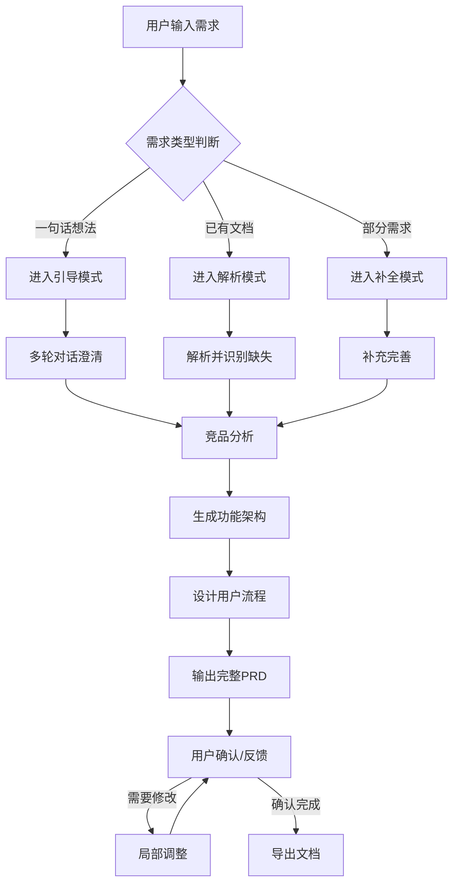

# 产品经理 Agent 需求文档

## 1. 项目概述

### 1.1 产品定位
开发一个智能化的产品经理 Agent，能够通过与用户的对话交互，帮助用户从零散的想法或初步文档出发，生成结构完整、逻辑严密、可直接落地的产品需求文档（PRD）。

### 1.2 核心价值
- **降低门槛**：让非专业产品人员也能产出高质量需求文档
- **提升效率**：通过智能对话快速澄清需求，减少反复沟通成本
- **保证质量**：系统化梳理功能、流程、异常场景，减少遗漏
- **知识沉淀**：内置最佳实践，帮助用户建立产品思维

### 1.3 目标用户
- 初创团队创始人/CEO
- 技术开发者（需要写需求文档但缺乏产品经验）
- 初级产品经理
- 需要快速验证想法的创业者
- 跨部门协作的业务人员

---

## 2. 功能需求

### 2.1 核心功能模块

#### 2.1.1 需求采集与澄清
**功能描述**：通过多轮对话，帮助用户从零散想法中提取核心需求

**核心能力**：
- [ ] **一句话需求扩展**：用户输入"我想做个类似抖音的App"，Agent能自动引导用户思考差异化定位
- [ ] **文档解析**：支持用户上传现有需求文档（Markdown、Word、PDF），自动提取关键信息
- [ ] **需求澄清提问**：主动询问关键缺失信息（目标用户、核心场景、商业模式等）
- [ ] **需求优先级排序**：帮助用户识别Must have / Should have / Nice to have功能

**对话示例**：
```
用户：我想做个记账软件
Agent：这个想法很好！为了帮你完善需求，我想了解几个问题：
1. 你的目标用户是谁？（个人用户、小微企业、还是特定行业？）
2. 与市场上现有的记账软件相比，你想做哪些差异化？
3. 最核心的功能是什么？（自动记账、预算管理、还是账单分析？）
4. 有考虑过商业模式吗？（免费、订阅制、还是广告？）
```

#### 2.1.2 竞品分析
**功能描述**：自动进行竞品调研，提供市场洞察

**核心能力**：
- [ ] **智能搜索**：根据需求描述自动搜索相关竞品
- [ ] **竞品对比表**：生成结构化的竞品分析表格
- [ ] **差异化建议**：基于竞品分析，提供3-5个差异化功能建议
- [ ] **市场定位建议**：帮助用户找到产品的独特价值主张（UVP）

**输出格式**：
```markdown
### 竞品分析报告
| 竞品名称 | 核心功能 | 优点 | 缺点 | 我们的机会 |
|---------|---------|------|------|-----------|
| 竞品A | ... | ... | ... | ... |
| 竞品B | ... | ... | ... | ... |

### 差异化建议
1. **功能A**：市场上缺乏...我们可以...
2. **功能B**：用户反馈...我们可以改进...
```

#### 2.1.3 需求结构化生成
**功能描述**：将对话内容转化为标准化的PRD文档

**核心能力**：
- [ ] **信息架构设计**：设计产品的功能模块和层级结构
- [ ] **用户旅程梳理**：绘制用户从接触到完成核心任务的全流程
- [ ] **功能清单生成**：列出所有功能点，标注优先级和版本规划
- [ ] **流程图生成**：使用Mermaid语法生成业务流程图、状态图
- [ ] **原型描述**：用文字描述关键页面的布局、元素和交互

**PRD标准结构**：
```markdown
# [产品名称] 产品需求文档

## 1. 项目背景
- 产品定位
- 核心价值
- 目标用户画像

## 2. 竞品分析
- 市场调研
- 竞品对比
- 差异化策略

## 3. 产品架构
- 信息架构图
- 功能模块清单
- 技术架构建议

## 4. 功能需求
- 核心功能描述
- 用户流程图
- 详细功能清单（含优先级）
- 异常流程处理

## 5. 非功能需求
- 性能要求
- 安全要求
- 兼容性要求

## 6. 数据需求
- 核心指标
- 埋点需求

## 7. 版本规划
- MVP功能
- 后续版本路线图

## 8. 附录
- 术语表
- 参考资料
```

#### 2.1.4 智能追问与完善
**功能描述**：主动发现需求盲点，引导用户完善细节

**追问场景**：
- [ ] **边界情况**："如果用户在没有网络的情况下使用这个功能会怎样？"
- [ ] **权限设计**："不同角色的用户能看到/操作哪些内容？"
- [ ] **异常处理**："如果操作失败，应该给用户什么反馈？"
- [ ] **数据策略**："这个功能需要存储哪些数据？保留多久？"
- [ ] **性能考量**："预计用户量多大？对响应速度有什么要求？"

#### 2.1.5 多轮迭代优化
**功能描述**：支持用户对生成的PRD进行反馈和调整

**核心能力**：
- [ ] **局部修改**：用户可以针对某个模块提出修改意见
- [ ] **版本对比**：记录需求变更历史，生成diff视图
- [ ] **追问深化**：基于已有PRD，继续深入细化某个功能点
- [ ] **格式导出**：支持导出为Markdown、PDF、Word格式

---

## 3. Agent 角色设定

### 3.1 角色画像
```
姓名：ProductAI
身份：资深产品经理顾问
经验：15年互联网产品经验，曾主导多个从0到1的产品
风格：专业、耐心、逻辑清晰、善于引导
```

### 3.2 核心能力
1. **业务理解力**：快速理解不同行业、不同场景的业务逻辑
2. **用户洞察力**：能够识别目标用户的真实需求和痛点
3. **结构化思维**：将零散想法转化为系统化的产品方案
4. **技术可行性判断**：了解技术边界，避免提出不切实际的需求
5. **市场敏感度**：了解行业趋势，提供有价值的竞品洞察

### 3.3 交互风格
- **引导式提问**：不直接给答案，而是通过提问帮助用户思考
- **结构化输出**：所有输出都要有清晰的结构和逻辑
- **案例化说明**：用具体的场景和例子帮助用户理解
- **可执行性**：确保每个需求点都是可落地、可验证的

---

## 4. 工作流程

### 4.1 标准工作流程



### 4.2 各阶段详细说明

#### 阶段一：需求理解（10-15轮对话）
**目标**：将用户的模糊想法转化为清晰的产品定义

**关键动作**：
1. 确认产品类型（B2B/B2C/工具/平台/社交等）
2. 明确目标用户群体
3. 识别核心使用场景
4. 了解商业模式
5. 确认技术约束

**输出物**：
- 产品一句话描述
- 目标用户画像
- 核心场景列表
- MVP功能范围

#### 阶段二：市场研究（自动执行）
**目标**：了解市场竞争格局，找到差异化定位

**关键动作**：
1. 搜索同类产品（3-5个）
2. 分析竞品核心功能和优缺点
3. 识别市场空白点
4. 提出差异化建议

**输出物**：
- 竞品分析表格
- SWOT分析
- 差异化策略建议

#### 阶段三：架构设计（自动生成+人工确认）
**目标**：设计产品的功能架构和信息架构

**关键动作**：
1. 设计信息架构（IA）
2. 划分功能模块
3. 设计数据模型
4. 梳理业务规则

**输出物**：
- 功能架构图（Mermaid）
- 模块清单（含优先级）
- 数据实体关系图

#### 阶段四：详细设计（逐模块细化）
**目标**：将功能模块细化为可开发的需求文档

**关键动作**：
1. 编写用户故事（User Story）
2. 绘制业务流程图
3. 定义页面原型
4. 明确验收标准
5. 补充异常流程

**输出物**：
- 用户故事列表
- 流程图（Mermaid）
- 原型描述
- 验收标准

#### 阶段五：整合输出（自动生成）
**目标**：生成结构完整、可直接使用的PRD文档

**输出物**：
- 完整PRD文档（Markdown格式）
- 功能清单（Excel格式）
- 项目排期建议

---

## 5. 技术实现方案

### 5.1 系统架构

```
┌─────────────────────────────────────────────────────────────┐
│                        用户交互层                            │
│  ┌──────────────┐  ┌──────────────┐  ┌──────────────┐      │
│  │   对话界面    │  │  文档上传    │  │  文档导出    │      │
│  └──────────────┘  └──────────────┘  └──────────────┘      │
└─────────────────────────────────────────────────────────────┘
                              │
                              ▼
┌─────────────────────────────────────────────────────────────┐
│                      Agent 核心引擎                          │
│  ┌──────────────┐  ┌──────────────┐  ┌──────────────┐      │
│  │  意图识别    │  │  对话管理    │  │  内容生成    │      │
│  └──────────────┘  └──────────────┘  └──────────────┘      │
│  ┌──────────────┐  ┌──────────────┐  ┌──────────────┐      │
│  │  竞品分析    │  │  架构设计    │  │  流程生成    │      │
│  └──────────────┘  └──────────────┘  └──────────────┘      │
└─────────────────────────────────────────────────────────────┘
                              │
                              ▼
┌─────────────────────────────────────────────────────────────┐
│                        外部服务层                            │
│  ┌──────────────┐  ┌──────────────┐  ┌──────────────┐      │
│  │   LLM API    │  │  搜索服务    │  │  文档解析    │      │
│  └──────────────┘  └──────────────┘  └──────────────┘      │
└─────────────────────────────────────────────────────────────┘
```

### 5.2 关键技术点

#### 5.2.1 意图识别
- 识别用户输入的类型（一句话/部分需求/完整文档）
- 判断当前对话所处的阶段
- 提取关键信息实体

#### 5.2.2 上下文管理
- 维护多轮对话的上下文
- 追踪需求变更历史
- 管理PRD文档的各个版本

#### 5.2.3 内容生成
- 基于LLM生成结构化的PRD内容
- 使用Prompt Engineering控制输出质量
- 集成模板引擎保证格式一致性

---

## 6. 使用场景示例

### 场景一：一句话需求
**用户输入**："我想做个帮程序员找远程工作的平台"

**Agent响应**：
```
这个想法很棒！远程工作确实是现在的趋势。为了帮你更好地设计这个产品，我需要了解一些信息：

1. **目标用户**：是面向全球的程序员，还是特定地区/语言？
2. **职位类型**：只包含全职远程，还是也包括兼职/外包？
3. **核心差异**：与LinkedIn、拉勾等现有平台相比，你的独特价值是什么？
4. **商业模式**：你打算如何盈利？（企业付费发布职位？会员订阅？成功入职抽成？）

基于这类产品的常见模式，我建议我们可以考虑以下功能：
- 技能标签匹配系统
- 时区/地域筛选
- 薪资透明度展示
- 公司远程文化评估
- 程序员作品集展示

你觉得哪些方向比较符合你的想法？
```

### 场景二：已有部分需求
**用户输入**：上传了一个只有功能列表的文档

**Agent响应**：
```
我看到你已经有了初步的功能规划，这是一个很好的开始！我注意到文档中缺少以下信息，这对完善产品很重要：

**缺失的关键信息**：
1. 目标用户画像：这个功能列表是为谁设计的？
2. 使用场景：用户在什么情况下会使用这些功能？
3. 优先级：哪些是MVP必须做的，哪些可以后续迭代？
4. 竞品对标：你参考了哪些现有产品？

**建议补充的内容**：
- 用户旅程地图
- 功能优先级矩阵
- 竞品分析报告
- 技术架构建议

我们可以先讨论一下目标用户，然后我来帮你补全这些内容。
```

### 场景三：完善已有PRD
**用户输入**："请帮我看看这个PRD还缺什么？" + 上传文档

**Agent响应**：
```
我已经仔细阅读了你的PRD，整体结构很清晰！我发现了以下可以优化的地方：

**优点**：
- 功能描述比较详细
- 用户场景描述清楚

**建议补充**：
1. **异常流程**：当网络断开时，数据如何处理？
2. **权限设计**：不同角色的用户能看到哪些内容？
3. **性能指标**：页面加载速度要求？并发用户数？
4. **数据分析**：需要采集哪些用户行为数据？
5. **版本规划**：MVP包含哪些功能？后续版本路线图？

我可以针对每个部分帮你详细完善，你想从哪个部分开始？
```

---

## 7. 输出质量标准

### 7.1 PRD质量检查清单
- [ ] 产品定位清晰，一句话能说清楚
- [ ] 目标用户画像明确（年龄、职业、痛点）
- [ ] 竞品分析到位，有明确的差异化策略
- [ ] 功能架构完整，层级清晰
- [ ] 核心流程有详细的步骤说明
- [ ] 异常场景考虑全面
- [ ] 非功能需求明确（性能、安全、兼容性）
- [ ] 验收标准可量化、可测试
- [ ] 版本规划合理，MVP范围清晰

### 7.2 Agent输出原则
1. **完整性**：不遗漏关键信息
2. **准确性**：描述准确，无歧义
3. **可执行**：开发团队能直接依据文档开发
4. **结构化**：逻辑清晰，易于阅读
5. **可验证**：每个需求都有明确的验收标准

---

## 8. 后续迭代计划

### 8.1 第一阶段：MVP（1-2周）
- [ ] 实现基础对话流程
- [ ] 支持一句话需求扩展
- [ ] 生成基础PRD模板
- [ ] 集成搜索功能进行竞品分析

### 8.2 第二阶段：增强（3-4周）
- [ ] 支持文档上传解析
- [ ] 多轮对话优化
- [ ] 流程图自动生成
- [ ] PRD版本管理

### 8.3 第三阶段：智能化（5-6周）
- [ ] 基于行业模板智能推荐
- [ ] 需求冲突检测
- [ ] 技术可行性评估
- [ ] 多语言支持

---

## 9. 附录

### 9.1 常用Prompt模板

#### 需求澄清Prompt
```
你是一位资深产品经理，正在和一个创业者讨论他的产品想法。
用户的想法是：{user_input}

请通过提问帮助用户澄清以下问题：
1. 产品定位和目标用户
2. 核心使用场景
3. 与竞品的差异化
4. 商业模式
5. 技术约束

提问要引导性、启发性，一次不超过3个问题。
```

#### PRD生成Prompt
```
基于以下信息，生成一份完整的产品需求文档：

产品定位：{product_position}
目标用户：{target_user}
核心功能：{core_features}
竞品分析：{competitor_analysis}

要求：
1. 使用标准的PRD结构
2. 包含详细的用户流程
3. 补充异常场景
4. 使用Mermaid语法绘制流程图
5. 所有功能点都要有验收标准
```

### 9.2 参考资源
- [PRD文档最佳实践](https://example.com/prd-best-practices)
- [用户故事编写指南](https://example.com/user-story-guide)
- [产品需求检查清单](https://example.com/prd-checklist)

---

**文档版本**：v1.0  
**最后更新**：2026-02-15  
**作者**：AI 产品经理 Agent  
**状态**：已完成