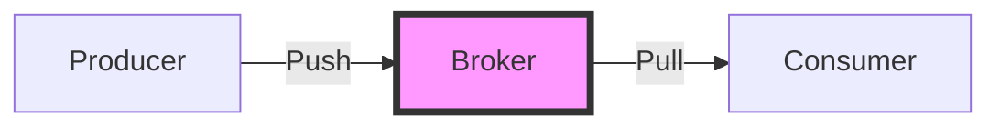

# Technical Blog Writing

## Overview
This skill guides the creation of high-quality, engaging, and structured technical blog posts. It emphasizes a lively, humorous tone to make technical concepts accessible and enjoyable, while maintaining technical rigor through architectural diagrams and code examples.

## When to Use
- User asks to write a "technical blog", "tech article", or "tutorial".
- User wants to explain a specific technology (framework, library, tool, algorithm) in an engaging way.
- User requests a blog post with a specific structure involving principles, trends, and examples.

## Tone & Style Guidelines
- **Humorous & Lively**: Avoid dry, textbook-style writing. Use metaphors, personification, and industry "memes" (where appropriate) to keep the reader engaged.
- **Conversational**: Write as if you are explaining a concept to a colleague over coffee/beer.
- **Visual-First**: explain complex concepts with diagrams first, then text.
- **Opinionated**: Don't just list facts; offer insights and context.

## Output Format
- **Format**: The final output MUST be a valid Markdown file (`.md`).
- **Diagrams**: Use Mermaid syntax code blocks (```mermaid ... ```) for all diagrams.
- **Code**: Use standard Markdown code blocks with language identifiers (e.g., ```python ... ```).

## Workflow

### 1. Context Gathering
Ask the user:
- What is the specific **Topic** or Technology?
- Who is the **Target Audience**? (Beginners, Experts, C-suite?)
- (Optional) Any specific angle or focus?

### 2. Structure Generation
Use the standard structure defined in `templates/blog-structure.md`.
You must include:
1.  **Background**: Origin story and problem statement.
2.  **Core Principles**: **MUST** include at least one **Architecture Diagram** and one **Flow Chart** (use Mermaid).
3.  **Trends**: Where is this tech going?
4.  **Milestones**: Key versions or events.
5.  **Code**: Practical, well-commented examples.
6.  **Summary**: Recap and value proposition.

### 3. Content Drafting
Draft the content section by section.
- **For Diagrams**: Use Mermaid syntax (e.g., `graph TD`, `sequenceDiagram`). Ensure they are accompanied by clear, explanatory text.
- **For Code**: Ensure comments explain the *why*, not just the *what*.

## Template Reference

Refer to `templates/blog-structure.md` for the markdown skeleton.

## Example Output Snippet

> "Kafka isn't just a message queue; it's the central nervous system of your data infrastructure. Imagine it as a high-speed post office where the postal workers are on steroids and never lose a letter."


