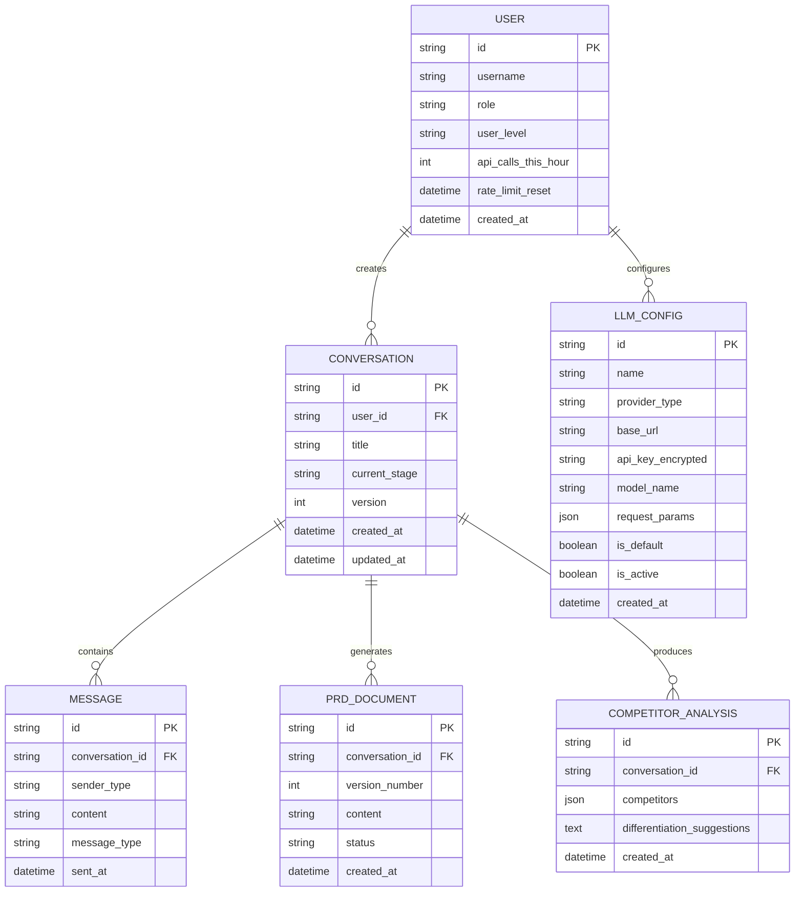

# Data Model: 产品经理 Agent

**Feature**: 001-product-manager-agent  
**Date**: 2026-02-15  
**Status**: Draft

---

## 实体关系图



---

## 实体详情

### 1. 用户 (User)

存储系统用户信息，包括限流配额。

| 字段 | 类型 | 约束 | 说明 |
|------|------|------|------|
| id | UUID | PK | 用户唯一标识 |
| username | VARCHAR(100) | UNIQUE, NOT NULL | 用户名 |
| role | ENUM | DEFAULT 'user' | 角色: user, admin |
| user_level | ENUM | DEFAULT 'normal' | 级别: normal, premium |
| api_calls_this_hour | INT | DEFAULT 0 | 当前小时API调用次数 |
| rate_limit_reset | DATETIME | | 限流重置时间 |
| created_at | DATETIME | NOT NULL | 创建时间 |

**索引**:
- `idx_user_level`: 按级别查询（用于限流统计）

---

### 2. 会话 (Conversation)

代表一次完整的产品需求讨论过程。

| 字段 | 类型 | 约束 | 说明 |
|------|------|------|------|
| id | UUID | PK | 会话唯一标识 |
| user_id | UUID | FK, NOT NULL | 关联用户 |
| title | VARCHAR(200) | | 会话标题（自动生成） |
| current_stage | ENUM | DEFAULT 'requirement_clarification' | 当前阶段 |
| version | INT | DEFAULT 1 | 乐观锁版本号 |
| created_at | DATETIME | NOT NULL | 创建时间 |
| updated_at | DATETIME | NOT NULL | 最后更新时间 |

**阶段枚举值**:
- `requirement_clarification`: 需求澄清
- `market_research`: 市场研究
- `architecture_design`: 架构设计
- `detailed_design`: 详细设计
- `integration_output`: 整合输出

**索引**:
- `idx_conversation_user`: 按用户查询会话列表
- `idx_conversation_updated`: 按更新时间排序

---

### 3. 消息 (Message)

会话中的对话记录。

| 字段 | 类型 | 约束 | 说明 |
|------|------|------|------|
| id | UUID | PK | 消息唯一标识 |
| conversation_id | UUID | FK, NOT NULL | 关联会话 |
| sender_type | ENUM | NOT NULL | 发送者: user, agent |
| content | TEXT | NOT NULL | 消息内容 |
| message_type | ENUM | DEFAULT 'text' | 类型: text, structured, chart |
| sent_at | DATETIME | NOT NULL | 发送时间 |

**消息类型**:
- `text`: 纯文本消息
- `structured`: 结构化内容（如竞品分析表格）
- `chart`: 图表（如Mermaid流程图）

**索引**:
- `idx_message_conversation`: 按会话查询消息列表
- `idx_message_sent`: 按时间排序

---

### 4. PRD文档 (PRDDocument)

生成的产品需求文档。

| 字段 | 类型 | 约束 | 说明 |
|------|------|------|------|
| id | UUID | PK | 文档唯一标识 |
| conversation_id | UUID | FK, NOT NULL | 关联会话 |
| version_number | INT | NOT NULL | 版本号（1, 2, 3...） |
| content | TEXT | NOT NULL | PRD内容（Markdown格式） |
| status | ENUM | DEFAULT 'draft' | 状态 |
| created_at | DATETIME | NOT NULL | 创建时间 |

**状态枚举值**:
- `draft`: 草稿
- `confirmed`: 已确认
- `archived`: 已归档（90天后自动归档）

**索引**:
- `idx_prd_conversation`: 按会话查询PRD列表
- `idx_prd_version`: 按版本号查询

**约束**:
- UNIQUE(conversation_id, version_number): 同一会话版本号唯一

---

### 5. 竞品分析 (CompetitorAnalysis)

竞品分析结果。

| 字段 | 类型 | 约束 | 说明 |
|------|------|------|------|
| id | UUID | PK | 分析唯一标识 |
| conversation_id | UUID | FK, NOT NULL | 关联会话 |
| competitors | JSON | NOT NULL | 竞品列表 |
| differentiation_suggestions | TEXT | | 差异化建议 |
| created_at | DATETIME | NOT NULL | 创建时间 |

**competitors JSON 结构**:
```json
[
  {
    "name": "竞品A",
    "core_features": ["功能1", "功能2"],
    "pros": ["优点1", "优点2"],
    "cons": ["缺点1", "缺点2"],
    "opportunity": "我们的机会"
  }
]
```

**索引**:
- `idx_analysis_conversation`: 按会话查询

---

### 6. 大模型配置 (LLMConfig)

大模型API配置信息。

| 字段 | 类型 | 约束 | 说明 |
|------|------|------|------|
| id | UUID | PK | 配置唯一标识 |
| name | VARCHAR(100) | NOT NULL | 配置名称（如"OpenAI GPT-4"） |
| provider_type | ENUM | NOT NULL | 供应商类型 |
| base_url | VARCHAR(500) | NOT NULL | API基础URL |
| api_key_encrypted | TEXT | NOT NULL | 加密的API Key |
| model_name | VARCHAR(100) | NOT NULL | 模型名称 |
| request_params | JSON | | 请求参数 |
| is_default | BOOLEAN | DEFAULT false | 是否默认配置 |
| is_active | BOOLEAN | DEFAULT true | 是否启用 |
| created_at | DATETIME | NOT NULL | 创建时间 |

**供应商类型枚举值**:
- `openai`: OpenAI
- `anthropic`: Anthropic (Claude)
- `azure_openai`: Azure OpenAI
- `baidu`: 百度文心一言
- `aliyun`: 阿里通义千问
- `other`: 其他（通用OpenAI兼容格式）

**request_params JSON 结构**:
```json
{
  "temperature": 0.7,
  "max_tokens": 4000,
  "timeout": 30
}
```

**索引**:
- `idx_llm_provider`: 按供应商类型查询
- `idx_llm_default`: 查询默认配置

**约束**:
- 只有一个配置可以设置 is_default = true

---

## 状态流转

### PRD文档状态流转

```
┌─────────┐    生成      ┌───────────┐    用户确认    ┌─────────┐
│  初始   │ ────────────► │   草稿    │ ────────────► │ 已确认  │
└─────────┘              └───────────┘              └────┬────┘
                                                         │
                                                         │ 90天后
                                                         ▼
                                                   ┌─────────┐
                                                   │ 已归档  │
                                                   └─────────┘
```

### 会话阶段流转

```
需求澄清 ──► 市场研究 ──► 架构设计 ──► 详细设计 ──► 整合输出
  ▲                                              │
  └────────────── 用户要求修改 ──────────────────┘
```

---

## 数据库迁移脚本

```sql
-- 用户表
CREATE TABLE users (
    id UUID PRIMARY KEY DEFAULT gen_random_uuid(),
    username VARCHAR(100) UNIQUE NOT NULL,
    role VARCHAR(20) DEFAULT 'user' CHECK (role IN ('user', 'admin')),
    user_level VARCHAR(20) DEFAULT 'normal' CHECK (user_level IN ('normal', 'premium')),
    api_calls_this_hour INT DEFAULT 0,
    rate_limit_reset TIMESTAMP,
    created_at TIMESTAMP NOT NULL DEFAULT CURRENT_TIMESTAMP
);

-- 会话表
CREATE TABLE conversations (
    id UUID PRIMARY KEY DEFAULT gen_random_uuid(),
    user_id UUID NOT NULL REFERENCES users(id) ON DELETE CASCADE,
    title VARCHAR(200),
    current_stage VARCHAR(50) DEFAULT 'requirement_clarification',
    version INT DEFAULT 1,
    created_at TIMESTAMP NOT NULL DEFAULT CURRENT_TIMESTAMP,
    updated_at TIMESTAMP NOT NULL DEFAULT CURRENT_TIMESTAMP
);

CREATE INDEX idx_conversation_user ON conversations(user_id);
CREATE INDEX idx_conversation_updated ON conversations(updated_at DESC);

-- 消息表
CREATE TABLE messages (
    id UUID PRIMARY KEY DEFAULT gen_random_uuid(),
    conversation_id UUID NOT NULL REFERENCES conversations(id) ON DELETE CASCADE,
    sender_type VARCHAR(20) NOT NULL CHECK (sender_type IN ('user', 'agent')),
    content TEXT NOT NULL,
    message_type VARCHAR(20) DEFAULT 'text' CHECK (message_type IN ('text', 'structured', 'chart')),
    sent_at TIMESTAMP NOT NULL DEFAULT CURRENT_TIMESTAMP
);

CREATE INDEX idx_message_conversation ON messages(conversation_id);
CREATE INDEX idx_message_sent ON messages(sent_at);

-- PRD文档表
CREATE TABLE prd_documents (
    id UUID PRIMARY KEY DEFAULT gen_random_uuid(),
    conversation_id UUID NOT NULL REFERENCES conversations(id) ON DELETE CASCADE,
    version_number INT NOT NULL,
    content TEXT NOT NULL,
    status VARCHAR(20) DEFAULT 'draft' CHECK (status IN ('draft', 'confirmed', 'archived')),
    created_at TIMESTAMP NOT NULL DEFAULT CURRENT_TIMESTAMP,
    UNIQUE(conversation_id, version_number)
);

CREATE INDEX idx_prd_conversation ON prd_documents(conversation_id);
CREATE INDEX idx_prd_version ON prd_documents(version_number);

-- 竞品分析表
CREATE TABLE competitor_analyses (
    id UUID PRIMARY KEY DEFAULT gen_random_uuid(),
    conversation_id UUID NOT NULL REFERENCES conversations(id) ON DELETE CASCADE,
    competitors JSON NOT NULL,
    differentiation_suggestions TEXT,
    created_at TIMESTAMP NOT NULL DEFAULT CURRENT_TIMESTAMP
);

CREATE INDEX idx_analysis_conversation ON competitor_analyses(conversation_id);

-- 大模型配置表
CREATE TABLE llm_configs (
    id UUID PRIMARY KEY DEFAULT gen_random_uuid(),
    name VARCHAR(100) NOT NULL,
    provider_type VARCHAR(50) NOT NULL,
    base_url VARCHAR(500) NOT NULL,
    api_key_encrypted TEXT NOT NULL,
    model_name VARCHAR(100) NOT NULL,
    request_params JSON,
    is_default BOOLEAN DEFAULT false,
    is_active BOOLEAN DEFAULT true,
    created_at TIMESTAMP NOT NULL DEFAULT CURRENT_TIMESTAMP
);

CREATE INDEX idx_llm_provider ON llm_configs(provider_type);
CREATE INDEX idx_llm_default ON llm_configs(is_default) WHERE is_default = true;

-- 确保只有一个默认配置
CREATE UNIQUE INDEX idx_llm_single_default ON llm_configs(is_default) 
    WHERE is_default = true;
```

---

## Redis 数据结构

用于限流和缓存：

```
# 限流 - 用户API调用计数
Key: rate_limit:{user_id}:{YYYY-MM-DD-HH}
Value: 调用次数 (INT)
TTL: 3600 秒（1小时）

# 缓存 - 会话上下文
Key: conversation:{conversation_id}:context
Value: 最近消息列表 (JSON)
TTL: 3600 秒（1小时）

# 缓存 - 大模型配置
Key: llm_config:default
Value: 默认配置ID (String)
TTL: 300 秒（5分钟）
```
